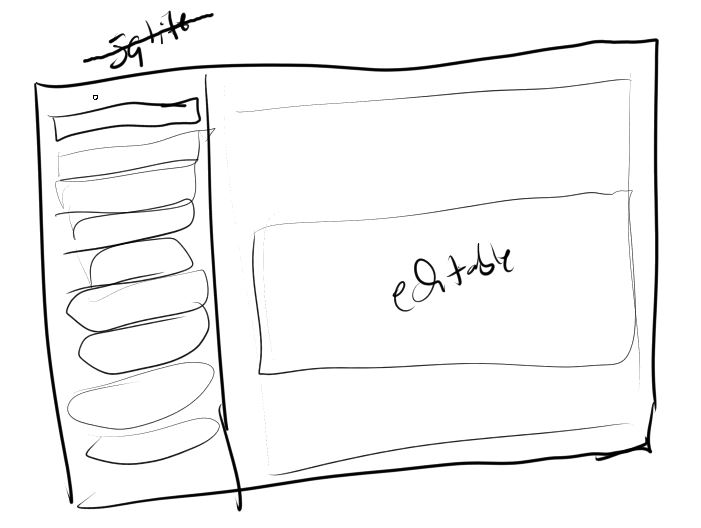
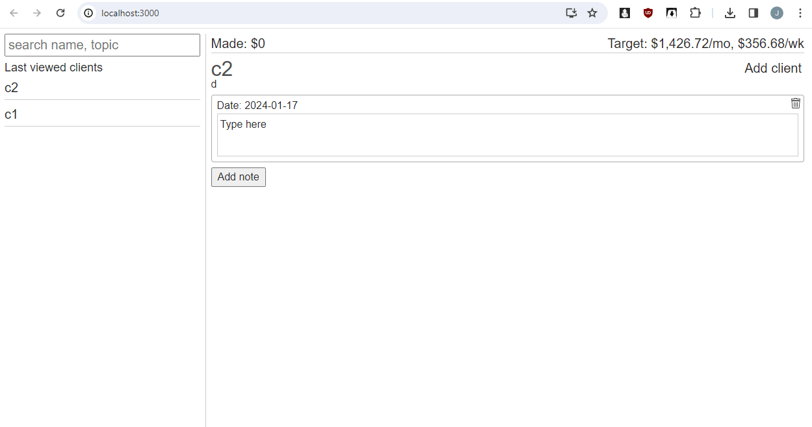
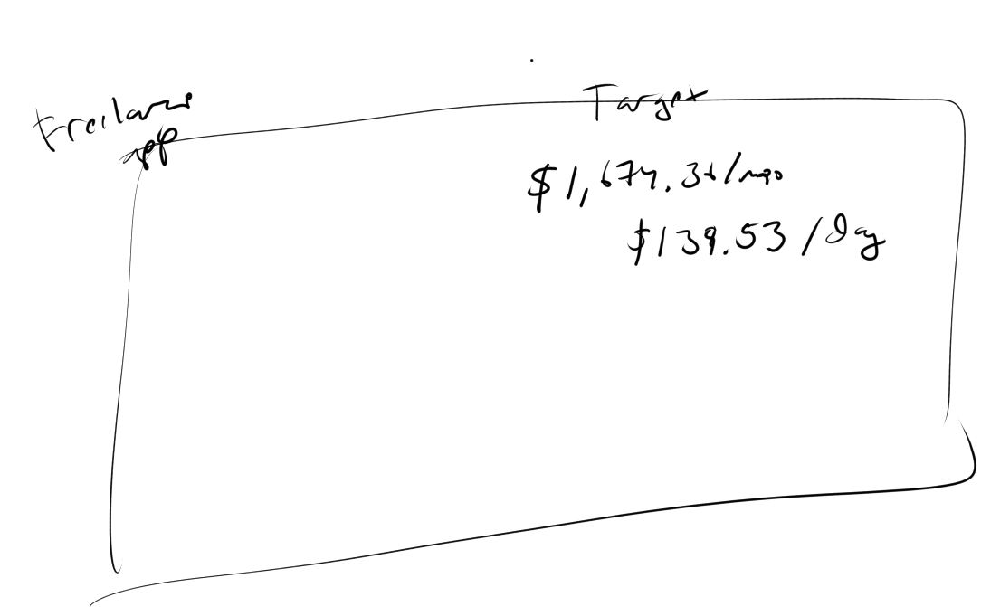

- [ ] hours counter with details of client/what
  - should show on top bar
- [x] add sidebar collapse feature, needs icons (01/24/2024 only used 1 icon)

01/24/2024

6:03 PM

Adding the collapsing sidebar real quick

Pretty cool I built it for mac and it just worked other than a start up menu label issue

6:51 PM

Oh man... I just realized if two instances are open they'll overwrite each other

Need a way to tell the other instance to sync damn... ugh... I can do it (websocket) but I'm lazy...

I don't want to lose data though either, there are no copies, just one

Ugh... fine I'll do it

7:32 PM

Damn... I feel bad I just dumped that socket code in app/right body should be isolated somewhere

ahh... well, don't have the time, hobby project/tool

8:27 PM

Alright... I added it... pretty cool, see the other side update

Issue is... it matches tabs/same state haha... so yeah

8:35 PM

Ugh... it stopped working

8:59 PM

That seems better will see how it goes

---

01/17/2024

12:31 AM

Damn I'm stuck on the refocus thing after repainting from react state update

I thought I had it... but that code was random trying/deleted lol could be just chance

This answer here https://stackoverflow.com/a/3656524 has a working example but you have to know how many lines down and what line across you are at...

12:42 AM

Oh man... I have it working for 1 but not more lines

2:36 AM

Damn... I am not getting this... the issue I was trying to fix is when you arrow around, the caret position is not preserved

Because the emitted event is not the same as a click target (accurate). The keyup event target is the parent not the child node.

Hmm...

There's also a noticeable lag on the click caret pos

As in if I type too fast after clicking the position is wrong

2:43 AM

Well... I dumped way too much time into this... I was aware caret stuff is tricky but yeah... "reinvent the wheel".

Will continue tomorrow, actually use this

12:20 PM

Back on

Gonna do the last bit of work to make this usable then use it/move on for now.

I did want to fork it although that will cause problems. To use as a general note taking app vs. freelancing intent.

The code is written with a lot of words for freelancing eg. client

12:24 PM

Ugh... wth I thought this issue was fixed the caret resume

The alternative is to have two copies... an invisible set that does the saving and this one is just display

Then the cursor won't be disturbed

That's a lot of work to do though and I have to start using this app

12:31 PM

- [x] client switching doesn't work (click tab on left)

Nice got that done

1:03 PM

Going to build this for now and start using it

The caret issue is bad and contentEditable needs work regarding font format/preventing div nesting

8:22 PM

Fuh... it's not usable, the jumping around caret is annoying

I'm gonna have to rework how this thing works... but I need to use it now...

I'll see if I can quickly redo this code... pretty much I'm going to "unreact" the contentEditable stuff so it stays as is, does data syncing in the background.

---

01/16/2024

2:56 PM

Still have not landed a gig but working for a client I worked with in the past at least

I've been able to get by by moving my balances around eg. pay this card, pull that money out and pay the other card... it's bad

I was thinking about putting a 1TB SSD on a raspberry pi at some point, I have a few running as servers at home but they're on the SD card/those can fail. Granted I buy the more expensive sandisk gold

3:09 PM

Distracted

3:18 PM

This concept is for a general note taking app (another project)

But same idea, sidebar, look up... little icons on left of sidebar tab like deadline

The right side, it will be scrollable with content editable sections (supports photo embed)

3:23 PM

I feel fortunate to know the skills that I know

I can just build stuff/will them into existence it's great

3:57 PM

Making progress, I've already deviated from the design

I woke up at 1 PM today so my sleep pattern is really bad already

Wasted time

4:08 PM

There's a lot of work to be done here still

Building this is not helping me make progress on my actual jobs but it is nice to build it as needed/know the desired features

4:22 PM

Distractions...

Damn... I need and API and a database?!!! REEEEEEEEE

4:31 PM

Since I'm using contenteditable there will be a table that is LONGTEXT each block is an entry

The blocks are time based, not automatic but if you haven't touched it in a while/add new one or continue editing previous entry

4:36 PM

Distracted, this is trivial work just setup

6:53 PM

Making progress, it's just work... will get to a usable state tonight. Break time

8:15 PM

I feel slower now but I gotta keep going, supposed to be using this as a tool

- [x] load client from click (done time)

9:13 PM

Hmm... I don't like this idea of "note"

10:16 PM

lol my D key is dying

10:36 PM

Distracted

11:07 PM

Lol this was worth it

The position is wrong/assumed end of content

I remember cursor being a PITA for WYSIWYG editors

11:22 PM

omg yes... I added the drag-drop in caret place

that's a good dopamine hit right there mmhmm

11:34 PM

There's always another problem lol

This time I have the data update but when it repaints the caret position goes to the beginning of the section

---

01/02/2024

2:11 PM

So I'm short by like `$1.5K`/mo or about `$370`/wk

right now I work 4x10s (labor) so I spend my worknights applying to jobs and applying to freelance

I have not landed a job... my last UpWork gig was from 2018

Since then I had been working in some form of tech job W2 eg. front end or software engineer of varying level

UpWork has changed since then... it's like a job takes 8 or 16 connects to apply to and each connect is $0.15 so yeah... just applying costs you money

Anyway this app would give me motivation seeing that number, $370 is not a lot... but it is if you can't land a gig

Also I'll finally take on the drag-drop base64 image to database task via contenteditable html... it's not hard, just have to do it

This is the Medium interface that's nice
